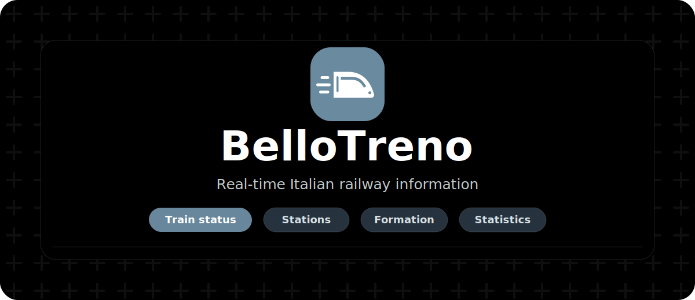

# BelloTreno



[](LICENSE)
[](https://astro.build/)
[](https://pages.cloudflare.com/)
[](https://github.com/06leong/bellotreno-site/actions/workflows/ci.yml)
[](https://github.com/06leong/bellotreno-site/actions/workflows/docker-images.yml)

BelloTreno is a real-time railway information website focused on Italian trains.
It brings together train running details, station departure and arrival boards,
RFI travel notices, cross-border formation data, and daily operating statistics in
a cleaner interface for railway enthusiasts and travelers.

Live site: [bellotreno.org](https://bellotreno.org/)

This is a personal railway data research project. It is not affiliated with
Trenitalia, RFI, FS Italiane, SBB, Trenord, TILO, or OpenTransportData.swiss.

## What It Does

BelloTreno helps users inspect the current state of Italian railway services:

- Search a train number and view its route, status, delay, platforms, stop list,
  and last known position.
- Open station boards for departures and arrivals, including platform changes and
  destination information.
- Read RFI travel notices and filter public disruption information by region.
- View supported Swiss cross-border train formations, including coach order,
  platform sectors, accessibility, bicycle, seat, and vehicle details.
- Enrich selected EC, TILO, SBB/Trenord regional, and other Swiss-linked services
  when OpenTransportData.swiss formation data is available.
- Explore daily railway operating statistics, including running trains,
  cancellations, rescheduled services, categories, punctuality, stations, and
  relations.
- Use the site in Chinese, English, or Italian, with light, dark, and system
  themes.

## Main Features

### Train Details

The main search page is built around train-number lookup. It keeps the
ViaggiaTreno result as the authoritative Italian data source, then adds extra
information only when a compatible source is available.

### Station Boards

Station pages show departures and arrivals with operator/category badges,
platforms, route endpoints, and selected Swiss completion for border-truncated
services.

### Train Formation

For supported cross-border trains, BelloTreno can show a passenger-facing coach
strip with platform sectors, coach numbers, seating classes, vehicle facilities,
and detailed EVN/type information. If formation data is unavailable, the normal
Italian train view remains unchanged.

### Railway Statistics

The statistics page summarizes observable daily operations from the backend
collector: trains in circulation, monitored trains, regular/cancelled/rescheduled
services, delay leaders, station summaries, relation summaries, and category
distribution.

## Data Sources

BelloTreno combines public and externally proxied railway data:

- ViaggiaTreno train and station running data.
- RFI public travel notice feeds.
- ViaggiaTreno SmartCaring notices for supported services.
- OpenTransportData.swiss Train Formation Service for selected Swiss cross-border
  formations.
- A VPS-side statistics collector that scans ViaggiaTreno station boards and
  stores daily aggregates.

Data availability depends on the upstream systems. Some operators and local
railway companies may remain incomplete or unavailable.

## Project Status

The project currently focuses on:

- Italian train search and station boards.
- Swiss cross-border enrichment for practical passenger information.
- Daily observable railway statistics.
- Mobile-friendly use and multilingual presentation.

Known limitations include imperfect upstream station/platform data, incomplete
coverage for some local railway companies, and the fact that statistics are based
on observable data rather than official full-network reports.

## Documentation

Detailed implementation notes live in the `doc/` directory:

- [Project guide](doc/PROJECT_GUIDE.md)
- [Agent/developer notes](doc/AGENTS.md)
- [TypeScript migration audit](doc/typescript-migration-audit.md)
- [innerHTML audit notes](doc/innerhtml-audit.md)
- [ViaggiaTreno API notes](doc/blog-viaggiatreno-api.md)
- [Swiss Open Data integration guide](doc/swiss-open-data-integration-guide.md)

VPS-side service notes are in [rfi-proxy/README.md](rfi-proxy/README.md).

## Local Development

```bash
npm install
npm run dev
npm run check
npm run build
```

The frontend is an Astro static site with strict TypeScript browser modules
under `src/client/`, typed Cloudflare Pages Functions under `functions/api/`,
shared normalizers under `src/lib/normalizers/`, and typed maintenance scripts
under `scripts/`. Production deployment is designed for Cloudflare Pages, with
Pages Functions used for token-protected server-side API calls.

Runtime JavaScript source should not be added under `public/scripts/`. Browser
code is authored as TypeScript and bundled by Astro/Vite into hashed assets.
`npm run check:no-raw-js` fails if raw `.js`, `.mjs`, or `.cjs` source files are
added outside generated/dependency directories.
Fonts are configured through Astro's Fonts API so generated font files are served
from the built site instead of loading Google Fonts at page runtime.

For a quick deployed-page smoke check, run `npm run smoke:pages` against a local
server or set `SMOKE_BASE_URL` to a Cloudflare Pages Preview URL.

## Disclaimer

BelloTreno is for personal research, railway enthusiast use, and educational
purposes. It does not guarantee data accuracy, completeness, availability, or
real-time correctness.

Always rely on official railway channels, station displays, operator apps, and
staff instructions for travel decisions.

## License

This project is licensed under the [MIT License](LICENSE).
