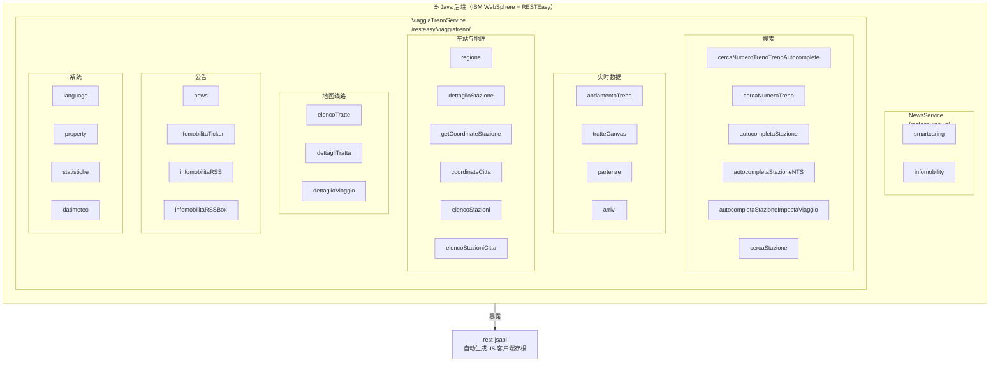
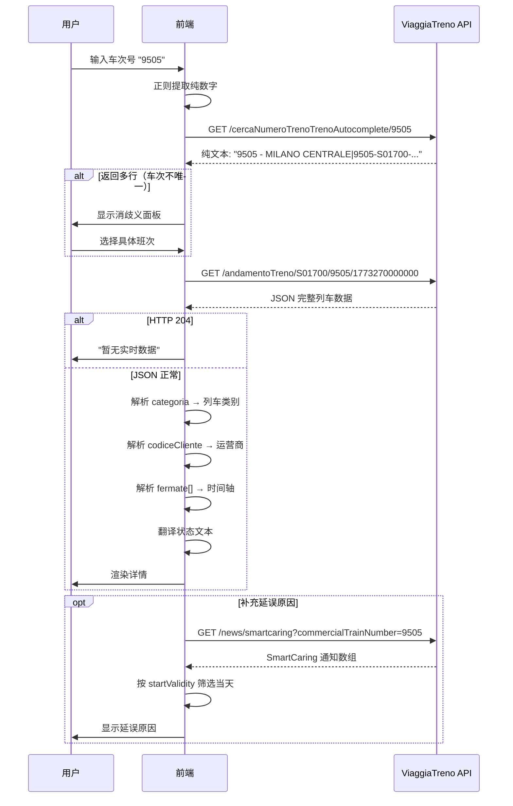
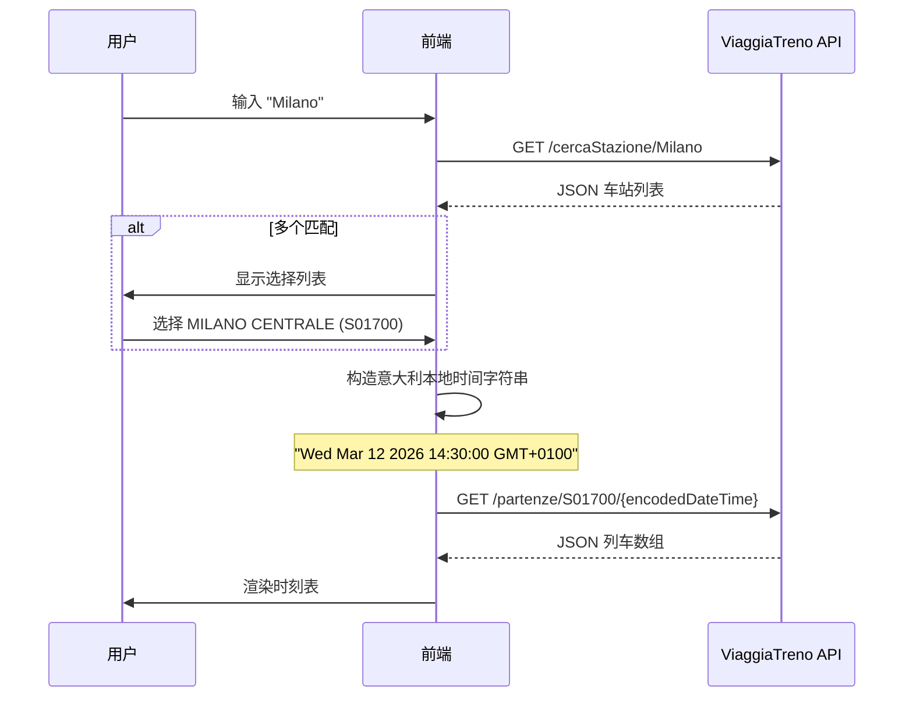
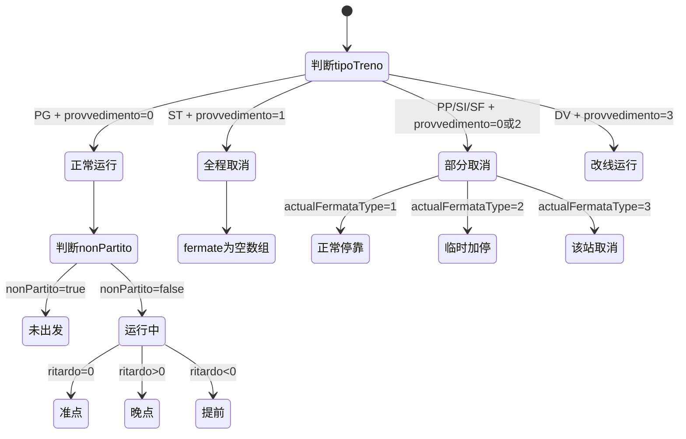

# ViaggiaTreno API 介绍
> **Caution：** 本文信息来自个人研究、社区分析。非 FS（意大利国铁集团）官方文档。不保证信息的完整性和长期有效性。API 随时可能变更。

## 什么是 ViaggiaTreno

[ViaggiaTreno](http://www.viaggiatreno.it/infomobilita/index.jsp) 是FS集团Trenitalia (包含Trenord,Trenitalai TPER,FSE,FondazioneFS/TTI)运营的列车实时信息系统。它的 Web 前端通过一套 HTTP API 获取列车运行、车站时刻表、铁路公告等数据。


### Base URL

```
http://www.viaggiatreno.it/infomobilita/resteasy/viaggiatreno/
```

所有端点均挂载在此路径下，使用 `HTTP GET` 方法调用。

另有一个移动端入口，路径结构完全相同：

```
http://www.viaggiatreno.it/infomobilitamobile/resteasy/viaggiatreno/
```

---

## API介绍

### 通过官方JS的发现

在 `http://www.viaggiatreno.it/infomobilitamobile/rest-jsapi` 可以访问到一个 JavaScript 文件，这是 **RESTEasy 框架自动生成的客户端存根**（client stub）。文件头部注释为：

```javascript
// start RESTEasy client API
// ...
// start JAX-RS API
REST.apiURL = 'http://www.viaggiatreno.it/infomobilitamobile';
```
后端技术栈使用了：

- **JAX-RS**（Java API for RESTful Web Services）：Java 世界中构建 REST 服务的标准规范
- **RESTEasy**：Red Hat / JBoss 对 JAX-RS 规范的实现


### 具体形式

`rest-jsapi` 揭示了系统由两个独立的 JAX-RS 服务组成：

| 命名空间 | Base Path | 职责 |
|---|---|---|
| `NewsService` | `/resteasy/news/` | 推送通知、Infomobility 新闻 |
| `ViaggiaTrenoService` | `/resteasy/viaggiatreno/` | 列车查询、车站信息、统计等核心功能 |


### 车站代码（ID Stazione）

意大利铁路车站使用形如 `S08409`（ROMA TERMINI）、`S01700`（Milano Centrale）的编码。

- 大部分 API 直接使用完整编码


### 列车三元组（Triple）

意大利铁路中**车次号不是唯一标识**。同一编号可能属于不同始发站的不同列车。API 使用**三元组**来唯一标识一个列车运行实例：

```
{车次号}-{始发站ID}-{日期时间戳}
```

例如：`2025-S00219-1773270000000` 对应的是2025 - TORINO PORTA NUOVA - 12/03/26

其中时间戳为**当日零时（意大利时间 `Europe/Rome`）的 Unix 毫秒值**。

### 列车状态编码

通过 `tipoTreno` + `provvedimento` 两个字段组合判断：

| `tipoTreno` | `provvedimento` | 含义 |
|---|---|---|
| `PG` | `0` | 正常运行 |
| `ST` | `1` | **全程取消**（`fermate` 数组为空） |
| `PP` / `SI` / `SF` | `0` 或 `2` | **部分取消** |
| `DV` | `3` | **改线运行** |

### 站点停靠类型

`fermate` 数组中每个元素的 `actualFermataType`：

| 值 | 含义 |
|---|---|
| `0` | 数据不可用（列车未到或数据未采集） |
| `1` | 正常停靠 |
| `2` | 临时加停（原计划不停靠） |
| `3` | 停靠被取消 |

`tipoFermata` 字段：

| 值 | 含义 |
|---|---|
| `P` | 始发站（Partenza） |
| `F` | 中间站（Fermata） |
| `A` | 终到站（Arrivo） |

### 多语言数组

`compRitardo` / `compRitardoAndamento` 等字段返回固定顺序的 9 种语言数组：

| 索引 | 语言 | 索引 | 语言 |
|---|---|---|---|
| 0 | 意大利语 | 5 | 罗马尼亚语 |
| 1 | 英语 | 6 | 日语 |
| 2 | 德语 | 7 | 中文 |
| 3 | 法语 | 8 | 俄语 |
| 4 | 西班牙语 | | |


### 时间参数格式

`partenze` 和 `arrivi` 端点要求一种非标准的时间字符串，即 JavaScript `Date.toString()` 的输出格式：

```
Wed Mar 05 2026 14:30:00 GMT+0100
```

- 星期和月份必须为英文缩写
- 必须包含正确的 GMT 偏移（CET: `+0100`，CEST 夏令时: `+0200`）
- 意大利夏令时切换：3月最后一个周日 → 10月最后一个周日

### 大区编码

| 编码 | 大区 | 编码 | 大区 |
|---|---|---|---|
| 1 | Lombardia | 12 | Veneto |
| 2 | Liguria | 13 | Toscana |
| 3 | Piemonte | 14 | Sicilia |
| 4 | Valle d'Aosta | 15 | Basilicata |
| 5 | Lazio | 16 | Puglia |
| 6 | Umbria | 17 | Calabria |
| 7 | Molise | 18 | Campania |
| 8 | Emilia Romagna | 19 | Abruzzo |
| 10 | Friuli Venezia Giulia | 20 | Sardegna |
| 11 | Marche | 22 | Trentino Alto Adige |

> 编码 9 和 21 缺失，推测为历史遗留。

### 列车类别

| 代码 | 全称 | 中文 |
|---|---|---|
| `REG` | Regionale | 区域列车(部分S线也使用REG类别) | 
| `RV` | Regionale Veloce | 快速区域列车 |
| `MET` | Metropolitano | 大都会列车，REG的变种 |
| `IC` | Intercity | 城际列车 |
| `ICN` | Intercity Notte | 城际夜车 |
| `FR` | Frecciarossa | 红箭高速列车 |
| `FA` | Frecciargento | 银箭 |
| `FB` | Frecciabianca | 白箭 |
| `EC` | Eurocity | 欧洲城际 |
| `EN` | EuroNight | 欧洲夜车 |
| `EC FR` | Eurocity Frecciarossa | EC红箭(目前Milano-Paris) |
| `EXP` | Espresso | 目前通常用于旅游或历史列车 |
| `TS` | Treno Storico | 历史列车 |

>  `EC FR` 在 `categoria` 字段中仍标记为 `EC`，需检查 `compNumeroTreno` 判断。`TS` 同理。

### 运营商代码

| 代码 | 内部标识 | 运营商 |
|---|---|---|
| `1` | TRENITALIA_AV | Trenitalia 高速 |
| `2` | TRENITALIA_REG | Trenitalia 区域 |
| `4` | TRENITALIA_IC | Trenitalia 城际 |
| `18` | TRENITALIA_TPER | Trenitalia TPER（艾米利亚-罗马涅） |
| `63` | TRENORD | Trenord（伦巴第） |
| `64` | OBB | ÖBB与Trenord合作列车（奥地利联邦铁路） |
| `77` | FS_TTI | FS Treni Turistici Italiani （存疑，来源于2026年2月Nike x FS 的ACG Express列车运行所提取出的信息）|
| `910` | FSE | Ferrovie del Sud Est（普利亚） |

---

## API使用


### 列车搜索

#### 车次搜索 — 纯文本

```
GET /cercaNumeroTrenoTrenoAutocomplete/{numeroTreno}
```

根据车次号查找三元组，是最常用的入口端点。


**示例请求(RV 2025)：**

```
/cercaNumeroTrenoTrenoAutocomplete/2025
```

**示例响应：**

```
2025 - TORINO PORTA NUOVA - 12/03/26|2025-S00219-1773270000000
```

每行格式为 `{描述}|{三元组}`，三元组 = `{车次号}-{始发站ID}-{时间戳}`。

**多结果场景：**

第一种为车次号重合，常见于伦巴第大区FNM线路上，车次号与FS排号方式不一致，导致重复。
```
/cercaNumeroTrenoTrenoAutocomplete/40
```
**REG 40 和 EC 40**
```
40 - LAVENO MOMBELLO LAGO - 12/03/26|40-S01747-1773270000000
40 - MILANO CENTRALE - 12/03/26|40-S01700-1773270000000
```

第二种情况出现在跨天列车，例如ICN或晚班列车。
```
/cercaNumeroTrenoTrenoAutocomplete/1963
```
**不同日期的ICN 1963**
```
1963 - MILANO CENTRALE - 11/03/26|1963-S01700-1773183600000
1963 - MILANO CENTRALE - 12/03/26|1963-S01700-1773270000000
```


标识两趟不同的列车时，需要让用户选择。

---

#### 车次搜索 JSON版

```
GET /cercaNumeroTreno/{numeroTreno}
```

**Accept：** `application/json`

**示例请求(FR 9505)：**

```
/cercaNumeroTreno/9505
```

**示例响应：**

```json
{
  "numeroTreno": "9505",
  "codLocOrig": "S01700",
  "descLocOrig": "MILANO CENTRALE",
  "dataPartenza": "2026-03-12",
  "corsa": "36505A",
  "h24": false,
  "tipo": "PG",
  "millisDataPartenza": "1773270000000",
  "formatDataPartenza": null
}
```

| 字段 | 类型 | 说明 | 示例值 |
|---|---|---|---|
| `numeroTreno` | string | 车次号 | `"9505"` |
| `codLocOrig` | string | 始发站代码 | `"S01700"` |
| `descLocOrig` | string | 始发站名称 | `"MILANO CENTRALE"` |
| `dataPartenza` | string | 出发日期 ISO 格式 | `"2026-03-12"` |
| `corsa` | string | 内部运行编号（生产号 + 后缀 `A`），与 SmartCaring 的 `productionTrainNumber` 相关 | `"36505A"` |
| `h24` | bool | 是否跨午夜运行（夜行列车为 true） | `false` |
| `tipo` | string | 列车状态类型，可预判列车是否已取消 | `"PG"` |
| `millisDataPartenza` | string | 出发日零时时间戳（注意是字符串类型，非数字） | `"1773270000000"` |
| `formatDataPartenza` | string/null | 格式化出发日期（实测始终为 null） | `null` |

**与纯文本版的区别：** JSON 版只返回当天最新的一个结果，不返回多日多车次；但提供了 `tipo`（状态预判）、`corsa`（生产编号）、`h24`（跨午夜标识）等独有字段。

---

### 列车详情

#### 列车运行详情

```
GET /andamentoTreno/{idStazione}/{numeroTreno}/{timestamp}
```

**Accept：** `application/json`

这是数据最丰富的端点，返回列车的完整运行状态。

**参数：**
- `idStazione`：始发站代码
- `numeroTreno`：车次号
- `timestamp`：当日零时 Unix 毫秒时间戳

**示例请求 (IC 550)：**

```
/andamentoTreno/S11781/550/1773270000000
```

**响应列车整体信息字段：**

```json
{
  "compOraUltimoRilevamento": "13:06",
  "motivoRitardoPrevalente": null,
  "descrizioneVCO": "",
  "materiale_label": null,
  "arrivato": false,
  "dataPartenzaTrenoAsDate": "2026-03-12",
  "dataPartenzaTreno": 1773270000000,
  "partenzaTreno": null,
  "millisDataPartenza": null,
  "numeroTreno": 550,
  "categoria": "IC",
  "categoriaDescrizione": null,
  "origine": "REGGIO DI CALABRIA CENTRALE",
  "codOrigine": null,
  "destinazione": "ROMA TERMINI",
  "codDestinazione": null,
  "origineEstera": null,
  "destinazioneEstera": null,
  "oraPartenzaEstera": null,
  "oraArrivoEstera": null,
  "tratta": 0,
  "regione": 0,
  "origineZero": "REGGIO DI CALABRIA CENTRALE",
  "destinazioneZero": "ROMA TERMINI",
  "orarioPartenzaZero": 1773291720000,
  "orarioArrivoZero": 1773318840000,
  "circolante": true,
  "binarioEffettivoArrivoCodice": null,
  "binarioEffettivoArrivoDescrizione": null,
  "binarioEffettivoArrivoTipo": null,
  "binarioProgrammatoArrivoCodice": null,
  "binarioProgrammatoArrivoDescrizione": null,
  "binarioEffettivoPartenzaCodice": null,
  "binarioEffettivoPartenzaDescrizione": null,
  "binarioEffettivoPartenzaTipo": null,
  "binarioProgrammatoPartenzaCodice": null,
  "binarioProgrammatoPartenzaDescrizione": null,
  "subTitle": "",
  "esisteCorsaZero": "0",
  "inStazione": false,
  "haCambiNumero": false,
  "nonPartito": false,
  "provvedimento": 0,
  "riprogrammazione": null,
  "orarioPartenza": 1773291720000,
  "orarioArrivo": 1773318840000,
  "stazionePartenza": null,
  "stazioneArrivo": null,
  "statoTreno": null,
  "corrispondenze": [],
  "servizi": [],
  "ritardo": 7,
  "tipoProdotto": "0",
  "compOrarioPartenzaZeroEffettivo": "06:09",
  "compOrarioArrivoZeroEffettivo": "13:41",
  "compOrarioPartenzaZero": "06:02",
  "compOrarioArrivoZero": "13:34",
  "compOrarioArrivo": "13:34",
  "compOrarioPartenza": "06:02",
  "compNumeroTreno": "IC 550",
  "compOrientamento": [
    "--",
    "--",
    "--",
    "--",
    "--",
    "--",
    "--",
    "--",
    "--"
  ],
  "compTipologiaTreno": "nazionale",
  "compClassRitardoTxt": "",
  "compClassRitardoLine": "regolare_line",
  "compImgRitardo2": "/vt_static/img/legenda/icone_legenda/regolare.png",
  "compImgRitardo": "/vt_static/img/legenda/icone_legenda/regolare.png",
  "compRitardo": [
    "ritardo 7 min.",
    "delay 7 min.",
    "Verspätung 7 Min.",
    "retard de 7 min.",
    "retraso de 7 min.",
    "întârziere 7 min.",
    "遅延 7 分",
    "误点 7分钟",
    "опоздание на 7 минут"
  ],
  "compRitardoAndamento": [
    "con un ritardo di 7 min.",
    "7 minutes late",
    "mit einer Verzögerung von 7 Min.",
    "avec un retard de 7 min.",
    "con un retraso de 7 min.",
    "cu o întârziere de 7 min.",
    "7 分の遅延",
    "误点 7分钟",
    "с опозданием в 7 минут"
  ],
  "fermate": [ ... ]
}
```

**始发站 REGGIO DI CALABRIA CENTRALE ：**

```json
{
  "tipoTreno": "PG",
  "orientamento": null,
  "codiceCliente": 4,
  "fermateSoppresse": [],
  "dataPartenza": "2026-03-12 00:00:00.0",
  "fermate": [
    {
      "orientamento": null,
      "kcNumTreno": null,
      "stazione": "REGGIO DI CALABRIA CENTRALE",
      "codLocOrig": "S11781",
      "id": "S11781",
      "listaCorrispondenze": [],
      "programmata": 1773291720000,
      "programmataZero": null,
      "effettiva": 1773291750000,
      "ritardo": 1,
      "partenzaTeoricaZero": null,
      "arrivoTeoricoZero": null,
      "partenza_teorica": 1773291720000,
      "arrivo_teorico": null,
      "isNextChanged": false,
      "partenzaReale": 1773291750000,
      "arrivoReale": null,
      "ritardoPartenza": 1,
      "ritardoArrivo": 0,
      "progressivo": 1,
      "binarioEffettivoArrivoCodice": null,
      "binarioEffettivoArrivoTipo": null,
      "binarioEffettivoArrivoDescrizione": null,
      "binarioProgrammatoArrivoCodice": null,
      "binarioProgrammatoArrivoDescrizione": null,
      "binarioEffettivoPartenzaCodice": "0",
      "binarioEffettivoPartenzaTipo": "0",
      "binarioEffettivoPartenzaDescrizione": "3",
      "binarioProgrammatoPartenzaCodice": null,
      "binarioProgrammatoPartenzaDescrizione": "5",
      "tipoFermata": "P",
      "visualizzaPrevista": true,
      "nextChanged": false,
      "nextTrattaType": 0,
      "actualFermataType": 1,
      "materiale_label": null
    }
}
```
**`fermate` 例子 中途站NAPOLI CENTRALE ：**
```json
{
      "orientamento": null,
      "kcNumTreno": null,
      "stazione": "NAPOLI CENTRALE",
      "codLocOrig": "S11781",
      "id": "S09218",
      "listaCorrispondenze": [],
      "programmata": 1773310620000,
      "programmataZero": null,
      "effettiva": 1773311550000,
      "ritardo": 2,
      "partenzaTeoricaZero": null,
      "arrivoTeoricoZero": null,
      "partenza_teorica": 1773311460000,
      "arrivo_teorico": 1773310620000,
      "isNextChanged": false,
      "partenzaReale": 1773311550000,
      "arrivoReale": 1773310230000,
      "ritardoPartenza": 2,
      "ritardoArrivo": -7,
      "progressivo": 75,
      "binarioEffettivoArrivoCodice": "245",
      "binarioEffettivoArrivoTipo": "0",
      "binarioEffettivoArrivoDescrizione": "13",
      "binarioProgrammatoArrivoCodice": null,
      "binarioProgrammatoArrivoDescrizione": "15",
      "binarioEffettivoPartenzaCodice": "262",
      "binarioEffettivoPartenzaTipo": "0",
      "binarioEffettivoPartenzaDescrizione": "13",
      "binarioProgrammatoPartenzaCodice": "14",
      "binarioProgrammatoPartenzaDescrizione": "XV",
      "tipoFermata": "F",
      "visualizzaPrevista": true,
      "nextChanged": false,
      "nextTrattaType": 0,
      "actualFermataType": 1,
      "materiale_label": null
    }
```

**终点站 ROMA TERMINI ：**
```json
 {
      "orientamento": null,
      "kcNumTreno": null,
      "stazione": "ROMA TERMINI",
      "codLocOrig": "S11781",
      "id": "S08409",
      "listaCorrispondenze": [],
      "programmata": 1773318840000,
      "programmataZero": null,
      "effettiva": null,
      "ritardo": 0,
      "partenzaTeoricaZero": null,
      "arrivoTeoricoZero": null,
      "partenza_teorica": null,
      "arrivo_teorico": 1773318840000,
      "isNextChanged": false,
      "partenzaReale": null,
      "arrivoReale": null,
      "ritardoPartenza": 0,
      "ritardoArrivo": 0,
      "progressivo": 100,
      "binarioEffettivoArrivoCodice": null,
      "binarioEffettivoArrivoTipo": null,
      "binarioEffettivoArrivoDescrizione": null,
      "binarioProgrammatoArrivoCodice": null,
      "binarioProgrammatoArrivoDescrizione": null,
      "binarioEffettivoPartenzaCodice": null,
      "binarioEffettivoPartenzaTipo": null,
      "binarioEffettivoPartenzaDescrizione": null,
      "binarioProgrammatoPartenzaCodice": null,
      "binarioProgrammatoPartenzaDescrizione": null,
      "tipoFermata": "A",
      "visualizzaPrevista": true,
      "nextChanged": false,
      "nextTrattaType": 2,
      "actualFermataType": 0,
      "materiale_label": null
    }

```


**顶层响应完整字段表（基于 FR 9505 实测数据）：**

| 字段 | 类型 | 说明 | 示例值 |
|---|---|---|---|
| `numeroTreno` | int | 车次号 | `9505` |
| `categoria` | string | 列车类别代码（FR 列车为空字符串，需用 `compNumeroTreno` 判断） | `""` / `"IC"` / `"REG"` |
| `categoriaDescrizione` | string/null | 类别描述文本（注意 FR 类前有空格 `" FR"`） | `" FR"` / `"IC"` / `null` |
| `compNumeroTreno` | string | 完整列车编号（类别+车次，最可靠的类别标识） | `" FR 9505"` / `"IC 550"` |
| `codiceCliente` | int | 运营商代码（1=AV, 2=REG, 4=IC, 18=TPER, 63=Trenord, 64=ÖBB） | `1` |
| `tipoTreno` | string | 列车状态类型 | `"PG"` / `"ST"` / `"PP"` / `"DV"` |
| `provvedimento` | int | 措施代码（与 `tipoTreno` 组合使用） | `0` / `1` / `2` / `3` |
| `origine` | string | 始发站名 | `"MILANO CENTRALE"` |
| `destinazione` | string | 终到站名 | `"SALERNO"` |
| `idOrigine` | string | 始发站代码 | `"S01700"` |
| `idDestinazione` | string | 终到站代码 | `"S09818"` |
| `origineZero` | string | 原始计划始发站（改线后可能与 `origine` 不同） | `"MILANO CENTRALE"` |
| `destinazioneZero` | string | 原始计划终到站 | `"SALERNO"` |
| `origineEstera` | string/null | 境外始发站（跨境列车，如巴黎） | `null` |
| `destinazioneEstera` | string/null | 境外终到站（跨境列车） | `"ZUERICH HB"` / `"BASEL SBB"` |
| `orarioPartenza` | long | 始发出发时间戳 | `1773288300000` |
| `orarioArrivo` | long | 终到到达时间戳 | `1773311220000` |
| `orarioPartenzaZero` | long | 原始计划出发时间 | `1773288300000` |
| `orarioArrivoZero` | long | 原始计划到达时间 | `1773311220000` |
| `compOrarioPartenza` | string | 始发时间 HH:MM | `"05:05"` |
| `compOrarioArrivo` | string | 终到时间 HH:MM | `"11:27"` |
| `compOrarioPartenzaZero` | string | 原始计划始发时间 HH:MM | `"05:05"` |
| `compOrarioArrivoZero` | string | 原始计划终到时间 HH:MM | `"11:27"` |
| `compOrarioPartenzaZeroEffettivo` | string | 实际始发时间 HH:MM | `"05:04"` |
| `compOrarioArrivoZeroEffettivo` | string | 实际终到时间 HH:MM | `"11:27"` |
| `compDurata` | string | 总时长（H:MM 格式） | `"6:22"` |
| `ritardo` | int | 当前延误（分钟，负值=提前） | `-1`（提前1分钟） |
| `nonPartito` | bool | 是否尚未出发 | `false` |
| `circolante` | bool | 列车是否在线路上运行中 | `true` |
| `arrivato` | bool | 是否已到达终点站 | `true` |
| `inStazione` | bool | 是否当前在某站停靠中 | `false` |
| `orientamento` | string/null | 编组方向代码 | `"A"` / `"B"` / `null` |
| `compOrientamento` | string[9] | 编组方向说明（9语言） | `["Executive in testa",...,"Executive在前几节车厢",...]` |
| `descOrientamento` | string[9] | 编组方向的详细描述（9语言，`andamentoTreno` 独有） | 同上 |
| `oraUltimoRilevamento` | long/null | 最后检测时间戳 | `1773311160000` |
| `stazioneUltimoRilevamento` | string | 最后检测车站名 | `"SALERNO"` |
| `compOraUltimoRilevamento` | string | 最后检测时间 HH:MM | `"11:26"` |
| `tipoProdotto` | string | 产品类型（`"100"` = 高速/商务, `"0"` = 普通） | `"100"` |
| `compTipologiaTreno` | string | 列车性质分类 | `"nazionale"` / `"regionale"` |
| `compRitardo` | string[9] | 延误/准点状态文本（9语言） | `["in orario",...,"按时",...]` |
| `compRitardoAndamento` | string[9] | 延误描述文本（9语言） | `["con un anticipo di 1 min.",...,"提前 1分钟",...]` |
| `compImgRitardo` | string | 状态图标路径 | `"/vt_static/img/.../regolare.png"` |
| `compImgRitardo2` | string | 备用状态图标路径 | 同上 |
| `compClassRitardoTxt` | string | 延误等级 CSS 类名（文本） | `""` / `"ritardo01_txt"` |
| `compClassRitardoLine` | string | 延误等级 CSS 类名（线条） | `"regolare_line"` / `"ritardo01_line"` |
| `haCambiNumero` | bool | 途中是否有车次号变更 | `false` |
| `cambiNumero` | array | 车次号变更记录（`andamentoTreno` 独有） | `[]` |
| `compImgCambiNumerazione` | string | 车次变更图标 HTML | `"  "` |
| `subTitle` | string | 副标题（取消/改线原因简述） | `""` |
| `riprogrammazione` | string/null | 是否重新编排（`"N"` = 否，`andamentoTreno` 为 null） | `null` / `"N"` |
| `motivoRitardoPrevalente` | string/null | 主要延误原因（很少有值） | `null` |
| `dataPartenza` | string | 出发日期文本 | `"2026-03-12 00:00:00.0"` |
| `dataPartenzaTreno` | long | 出发日零时时间戳 | `1773270000000` |
| `dataPartenzaTrenoAsDate` | string | 出发日期 ISO 格式 | `"2026-03-12"` |
| `esisteCorsaZero` | string | 是否存在原始运行记录 | `"0"` |
| `fermateSoppresse` | array | 被取消的停站列表（`andamentoTreno` 独有） | `[]` |
| `anormalita` | array | 异常记录（`andamentoTreno` 独有） | `[]` |
| `provvedimenti` | array | 措施记录（`andamentoTreno` 独有） | `[]` |
| `segnalazioni` | array | 信号报告（`andamentoTreno` 独有） | `[]` |
| `hasProvvedimenti` | bool | 是否有措施（`andamentoTreno` 独有） | `false` |
| `corrispondenze` | array | 换乘连接信息 | `[]` |
| `servizi` | array | 服务信息（餐车、WiFi 等） | `[]` |
| `tratta` | int | 线路段 | `0` |
| `regione` | int | 所属大区 | `0` |
| `ultimoRilev` | long/null | 最后检测时间戳（同 `oraUltimoRilevamento`，`partenze`/`arrivi` 专用） | `1773320340000` |

**`fermate` 数组元素完整字段表：**

| 字段 | 类型 | 说明 | 始发站示例 | 中间站示例 | 终到站示例 |
|---|---|---|---|---|---|
| `stazione` | string | 站名 | `"MILANO CENTRALE"` | `"NAPOLI CENTRALE"` | `"SALERNO"` |
| `id` | string | 车站代码 | `"S01700"` | `"S09218"` | `"S09818"` |
| `codLocOrig` | string | 列车始发站代码（所有站相同） | `"S01700"` | `"S01700"` | `"S01700"` |
| `tipoFermata` | string | 停靠类型 | `"P"`（始发） | `"F"`（中间） | `"A"`（终到） |
| `actualFermataType` | int | 停靠实际状态（0=无数据, 1=正常, 2=临时加停, 3=取消） | `1` | `1` | `1` |
| `programmata` | long | 计划时间（始发站=出发，终到站=到达） | `1773288300000` | `1773307680000` | `1773311220000` |
| `partenza_teorica` | long/null | 理论出发时间（终到站为 null） | `1773288300000` | `1773309000000` | `null` |
| `arrivo_teorico` | long/null | 理论到达时间（始发站为 null） | `null` | `1773307680000` | `1773311220000` |
| `effettiva` | long/null | 实际时间（综合出发/到达） | `1773288360000` | `1773309150000` | `1773311160000` |
| `partenzaReale` | long/null | 实际出发时间 | `1773288360000` | `1773309150000` | `null` |
| `arrivoReale` | long/null | 实际到达时间 | `null` | `1773307830000` | `1773311160000` |
| `ritardo` | int | 综合延误（分钟） | `1` | `3` | `-1` |
| `ritardoPartenza` | int | 出发延误（分钟） | `1` | `3` | `0` |
| `ritardoArrivo` | int | 到达延误（分钟，负=提前） | `0` | `3` | `-1` |
| `progressivo` | int | 进度(可能为经过检测点数) | `1` | `110` | `119` |
| `orientamento` | string/null | 该站的编组方向 | `"A"` | `"B"` | `"B"` |
| `binarioProgrammatoPartenzaDescrizione` | string/null | 计划出发站台号 | `"8"` | `"21"` | `null` |
| `binarioEffettivoPartenzaDescrizione` | string/null | 实际出发站台号 | `"8"` | `"17"` | `null` |
| `binarioProgrammatoArrivoDescrizione` | string/null | 计划到达站台号 | `null` | `"21"` | `"1"` |
| `binarioEffettivoArrivoDescrizione` | string/null | 实际到达站台号 | `null` | `"17"` | `"1"` |
| `binarioEffettivoPartenzaCodice` | string/null | 出发站台内部代码 | `"1985"` | `"300"` | `null` |
| `binarioEffettivoPartenzaTipo` | string/null | 出发站台类型代码 | `"0"` | `"0"` | `null` |
| `binarioEffettivoArrivoCodice` | string/null | 到达站台内部代码 | `null` | `"249"` | `"513"` |
| `binarioEffettivoArrivoTipo` | string/null | 到达站台类型代码 | `null` | `"0"` | `"0"` |
| `visualizzaPrevista` | bool | 是否显示预计时间 | `true` | `true` | `true` |
| `isNextChanged` | bool | 下一站信息是否有变化 | `false` | `false` | `false` |
| `nextChanged` | bool | 同上（冗余字段） | `false` | `false` | `false` |
| `nextTrattaType` | int | 下一段线路类型（0=正常, 2=终点后无） | `0` | `0` | `2` |
| `listaCorrispondenze` | array | 该站可换乘列车列表 | `[]` | `[]` | `[]` |
| `kcNumTreno` | string/null | KC 系统车次号（总为 null） | `null` | `null` | `null` |
| `programmataZero` | long/null | 原始计划时间（总为 null） | `null` | `null` | `null` |
| `partenzaTeoricaZero` | long/null | 原始理论出发（总为 null） | `null` | `null` | `null` |
| `arrivoTeoricoZero` | long/null | 原始理论到达（总为 null） | `null` | `null` | `null` |
| `materiale_label` | string/null | 车辆型号标签（总为 null） | `null` | `null` | `null` |


**延误等级与图标映射（基于实测 `compImgRitardo` / `compClassRitardoTxt`）：**

| 延误范围 | `compImgRitardo` 图标 | `compClassRitardoTxt` | `compClassRitardoLine` | 含义 |
|---|---|---|---|---|
| 未出发 | `nonpartito.png` | `null` | `null` | 尚未出发 |
| -∞ ~ 0 min | `regolare.png` | `""` | `regolare_line` | 准点或提前 |
| 1 ~ 10 min | `regolare.png` | `""` | `regolare_line` | 轻微延误（仍显示为"正常"） |
| 11 ~ 30 min | `ritardo01.png` | `"ritardo01_txt"` | `"ritardo01_line"` | 中等延误 |
| 31+ min | `ritardo02.png` | `"ritardo02_txt"` | `"ritardo02_line"` | 严重延误 |
| 检测失败 | `alert3.png` | — | — | 列车位置无法检测（`compRitardo[0]` = `"Mancato rilevamento"`） |

> **"Mancato rilevamento"（检测失败）状态：** 列车在运行中但 GPS/信号系统暂时无法定位。此时 `ritardo` 字段值可能不准确。实测 FR 8814 从 Lecce 出发时出现此状态，`compRitardo` 的非IT语言部分可能为 `null`。

**时间精度：** 所有时间戳向下取整至 30 秒，延误为整数分钟（向上取整）。

---

#### 列车停站数据

```
GET /tratteCanvas/{idStazione}/{numeroTreno}/{timestamp}
```

**Accept：** `application/json`

与 `andamentoTreno` 类似，但仅返回 `fermate` 数组部分，不含完整列车信息。适合只需要停站数据的场景，响应体更小。

---

### 车站搜索

#### 车站搜索 — 纯文本

```
GET /autocompletaStazione/{text}
```

**Accept：** `text/plain`

**示例请求：**

```
/autocompletaStazione/MILANO
```

**示例响应：**

```
MILANO CENTRALE|S01700
MILANO AFFORI|S01078
MILANO BOVISA POLITECNICO|S01642
MILANO BRUZZANO PARCO NORD|S01079
MILANO CADORNA|S01066
MILANO CERTOSA|S01640
MILANO DATEO|S01650
MILANO DOMODOSSOLA|S01067
MILANO FARINI|S01644
MILANO FORLANINI|S01492
MILANO GRECO PIRELLI|S01326
MILANO LAMBRATE|S01701
MILANO LANCETTI|S01643
MILANO PORTA GARIBALDI|S01645
MILANO PORTA GARIBALDI SOTTERRANEA|S01647
MILANO PORTA GENOVA|S01631
MILANO PORTA ROMANA|S01632
MILANO PORTA VENEZIA|S01649
MILANO PORTA VITTORIA|S01633
MILANO QUARTO OGGIARO|S01069
MILANO REPUBBLICA|S01648
MILANO ROGOREDO|S01820
MILANO ROMOLO|S01032
MILANO S.CRISTOFORO|S01630
MILANO TIBALDI UNIVERSITA' BOCCONI|S01022
MILANO VILLAPIZZONE|S01639
```

每行格式 `{车站名}|{车站代码}`。米兰共返回 26 个车站。排序：重要车站优先，其余按字母序。

还有变体：

```
GET /autocompletaStazioneNTS/{text}
```

NTS 系统的车站搜索，可能返回不同的车站集合。
```
MILANO CENTRALE|830001700
MILANO CERTOSA|830001640
MILANO DATEO|830001665
MILANO DOMODOSSOLA|830025750
MILANO FARINI|830001644
MILANO GRECO PIRELLI|830001326
MILANO LAMBRATE|830001701
MILANO LANCETTI|830001661
MILANO MAV|830001699
MILANO N.CADORNA|830025001
MILANO NORD BOVISA|830001642
MILANO PORTA GARIBALDI|830001645
MILANO PORTA GENOVA|830001631
MILANO PORTA ROMANA|830001632
MILANO PORTA VITTORIA|830001633
MILANO QUARTO OGGIARO|830025751
MILANO REPUBBLICA|830001663
MILANO ROGOREDO|830001820
MILANO ROMOLO|830001032
MILANO S.CRISTOFORO|830001630
MILANO SM.|830001702
MILANO VENEZIA|830001664
MILANO VILLAPIZZONE|830001666
MILANO AFFORI|830025005
MILANO BRUZZANO PARCO NORD|830025006
MILANO FORLANINI|830001492
MILANO PORTA GARIBALDI PASSANTE|830001662
MILANO TUTTE STAZ.|830008354
MILANO TUTTE STAZ.|830008352
MILANO TUTTE STZ|830001650
```


---

#### 车站搜索 — JSON版

```
GET /cercaStazione/{text}
```

**Accept：** `application/json`

**示例请求：**

```
/cercaStazione/TRIESTE
```

**示例响应：**

```json
[
  {
    "nomeLungo": "TRIESTE AIRPORT",
    "nomeBreve": "Trieste Airport",
    "label": "Trieste",
    "id": "S03213"
  },
  {
    "nomeLungo": "TRIESTE AQUILINIA",
    "nomeBreve": "Trieste Aq.linia",
    "label": null,
    "id": "S03856"
  },
  {
    "nomeLungo": "TRIESTE CENTRALE",
    "nomeBreve": "TRIESTE CENTRALE",
    "label": "Trieste",
    "id": "S03317"
  },
  {
    "nomeLungo": "TRIESTE SERVOLA",
    "nomeBreve": "Trieste Servola",
    "label": null,
    "id": "S03854"
  }
]
```

**`cercaStazione` 响应字段表：**

| 字段 | 类型 | 说明 | 示例值 |
|---|---|---|---|
| `nomeLungo` | string | 车站全名（全大写） | `"TRIESTE CENTRALE"` |
| `nomeBreve` | string | 车站简称（正常大小写，长名会缩写） | `"TRIESTE CENTRALE"` / `"Trieste Aq.linia"` |
| `label` | string/null | 城市标签（仅主要车站有值） | `"Trieste"` / `null` |
| `id` | string | 车站代码 | `"S03317"` |

> `label` 字段规律：只有每个城市的主要车站（中央站、机场站）有 `label` 值，小站为 `null`。可用于判断车站重要性。

---

### 车站时刻表

#### 出发时刻表

```
GET /partenze/{idStazione}/{dateTime}
```

**Accept：** `application/json`

#### 到达时刻表

```
GET /arrivi/{idStazione}/{dateTime}
```

**Accept：** `application/json`

**`dateTime` 格式：** 必须为 JavaScript `Date.toString()` 格式，需 URL 编码：

 CET 时间（2026年3月12日 13:31）
```
Thu%20Mar%2012%202026%2013:31:00%20GMT%2B0100
```


**Partenze出发时刻表响应示例（单条列车）：**

```json
{
    "arrivato": false,
    "dataPartenzaTrenoAsDate": "2026-03-12",
    "dataPartenzaTreno": 1773270000000,
    "partenzaTreno": null,
    "millisDataPartenza": "1773270000000",
    "numeroTreno": 17338,
    "categoria": "REG",
    "categoriaDescrizione": "REG",
    "origine": null,
    "codOrigine": "S03317",
    "destinazione": "VENEZIA S.LUCIA",
    "codDestinazione": null,
    "origineEstera": null,
    "destinazioneEstera": null,
    "oraPartenzaEstera": null,
    "oraArrivoEstera": null,
    "tratta": 0,
    "regione": 0,
    "origineZero": null,
    "destinazioneZero": null,
    "orarioPartenzaZero": null,
    "orarioArrivoZero": null,
    "circolante": false,
    "codiceCliente": 2,
    "binarioEffettivoArrivoCodice": null,
    "binarioEffettivoArrivoDescrizione": null,
    "binarioEffettivoArrivoTipo": null,
    "binarioProgrammatoArrivoCodice": null,
    "binarioProgrammatoArrivoDescrizione": null,
    "binarioEffettivoPartenzaCodice": "0",
    "binarioEffettivoPartenzaDescrizione": "5",
    "binarioEffettivoPartenzaTipo": "0",
    "binarioProgrammatoPartenzaCodice": "0",
    "binarioProgrammatoPartenzaDescrizione": "5",
    "subTitle": null,
    "esisteCorsaZero": null,
    "orientamento": null,
    "inStazione": false,
    "haCambiNumero": false,
    "nonPartito": true,
    "provvedimento": 0,
    "riprogrammazione": "N",
    "orarioPartenza": 1773318720000,
    "orarioArrivo": null,
    "stazionePartenza": null,
    "stazioneArrivo": null,
    "statoTreno": null,
    "corrispondenze": [],
    "servizi": [],
    "ritardo": 0,
    "tipoProdotto": "0",
    "compOrarioPartenzaZeroEffettivo": "13:32",
    "compOrarioArrivoZeroEffettivo": null,
    "compOrarioPartenzaZero": "13:32",
    "compOrarioArrivoZero": null,
    "compOrarioArrivo": null,
    "compOrarioPartenza": "13:32",
    "compNumeroTreno": "REG 17338",
    "compOrientamento": [
      "--",
      "--",
      "--",
      "--",
      "--",
      "--",
      "--",
      "--",
      "--"
    ],
    "compTipologiaTreno": "regionale",
    "compClassRitardoTxt": null,
    "compClassRitardoLine": null,
    "compImgRitardo2": "/vt_static/img/legenda/icone_legenda/nonpartito.png",
    "compImgRitardo": "/vt_static/img/legenda/icone_legenda/nonpartito.png",
    "compRitardo": [
      "non partito",
      "not departed",
      "keine Partei",
      "pas encore partit",
      "no salió",
      "nu a plecat",
      "未発車",
      "未出发",
      "не отправленный"
    ],
    "compRitardoAndamento": [
      "non partito",
      "not departed",
      "keine Partei",
      "pas encore partit",
      "no salió",
      "nu a plecat",
      "未発車",
      "未出发",
      "не отправленный"
    ],
```

**Arrivi到达时刻表特有字段：**

```json
{
  "arrivato": false,
    "dataPartenzaTrenoAsDate": "2026-03-12",
    "dataPartenzaTreno": 1773270000000,
    "partenzaTreno": 1773315420000,
    "millisDataPartenza": null,
    "numeroTreno": 3807,
    "categoria": "REG",
    "categoriaDescrizione": "REG",
    "origine": "UDINE",
    "codOrigine": "S03026",
    "destinazione": null,
    "codDestinazione": null,
    "origineEstera": null,
    "destinazioneEstera": null,
    "oraPartenzaEstera": null,
    "oraArrivoEstera": null,
    "tratta": 0,
    "regione": 0,
    "origineZero": null,
    "destinazioneZero": null,
    "orarioPartenzaZero": null,
    "orarioArrivoZero": null,
    "circolante": true,
    "codiceCliente": 2,
    "binarioEffettivoArrivoCodice": null,
    "binarioEffettivoArrivoDescrizione": null,
    "binarioEffettivoArrivoTipo": null,
    "binarioProgrammatoArrivoCodice": null,
    "binarioProgrammatoArrivoDescrizione": "4",
    "binarioEffettivoPartenzaCodice": null,
    "binarioEffettivoPartenzaDescrizione": null,
    "binarioEffettivoPartenzaTipo": null,
    "binarioProgrammatoPartenzaCodice": null,
    "binarioProgrammatoPartenzaDescrizione": null,
    "subTitle": null,
    "esisteCorsaZero": null,
    "orientamento": null,
    "inStazione": false,
    "haCambiNumero": false,
    "nonPartito": false,
    "provvedimento": 0,
    "riprogrammazione": "N",
    "orarioPartenza": null,
    "orarioArrivo": 1773319200000,
    "stazionePartenza": null,
    "stazioneArrivo": null,
    "statoTreno": null,
    "corrispondenze": [],
    "servizi": [],
    "ritardo": 4,
    "tipoProdotto": "0",
    "compOrarioPartenzaZeroEffettivo": null,
    "compOrarioArrivoZeroEffettivo": null,
    "compOrarioPartenzaZero": null,
    "compOrarioArrivoZero": null,
    "compOrarioArrivo": "13:40",
    "compOrarioPartenza": null,
    "compNumeroTreno": "REG 3807",
    "compOrientamento": [
      "--",
      "--",
      "--",
      "--",
      "--",
      "--",
      "--",
      "--",
      "--"
    ],
    "compTipologiaTreno": "regionale",
    "compClassRitardoTxt": "",
    "compClassRitardoLine": "regolare_line",
    "compImgRitardo2": "/vt_static/img/legenda/icone_legenda/regolare.png",
    "compImgRitardo": "/vt_static/img/legenda/icone_legenda/regolare.png",
    "compRitardo": [
      "ritardo 4 min.",
      "delay 4 min.",
      "Verspätung 4 Min.",
      "retard de 4 min.",
      "retraso de 4 min.",
      "întârziere 4 min.",
      "遅延 4 分",
      "误点 4分钟",
      "опоздание на 4 минут"
    ]
}
```

**`partenze`/`arrivi` 完整字段表（与 `andamentoTreno` 顶层字段大部分相同，以下列出特有差异和关键字段）：**

| 字段 | 出发表（partenze） | 到达表（arrivi） | 说明 |
|---|---|---|---|
| `origine` | `null` | `"TRIESTE CENTRALE"` | 出发表不含始发站名 |
| `codOrigine` | `"S01700"`（本站代码） | `"S03317"` | 出发表=本站代码，到达表=列车始发站 |
| `destinazione` | `"VENEZIA S.LUCIA"` | `null` | 到达表不含目的地名 |
| `codDestinazione` | `null` | `null` | 两者都不提供目的地代码 |
| `destinazioneEstera` | `"ZUERICH HB"` | `null` | 出发表可含境外目的地 |
| `orarioPartenza` | `1773319500000` | `null` | 出发表有出发时间，到达表为 null |
| `orarioArrivo` | `null` | `1773319500000` | 到达表有到达时间，出发表为 null |
| `compOrarioPartenza` | `"13:45"` | `null` | 同上 |
| `compOrarioArrivo` | `null` | `"13:45"` | 同上 |
| `partenzaTreno` | `1773319650000`（实际出发时间戳） | `1773304770000` | 列车从始发站的实际出发时间 |
| `millisDataPartenza` | `"1773270000000"` | `null` | 出发表为字符串，到达表为 null |
| `riprogrammazione` | `"N"` | `"N"` | 是否重新编排（partenze/arrivi 特有） |
| `compOrarioEffettivoArrivo` | `null` | 见下方 | 到达表特有，格式异常 |
| `compInStazionePartenza` | string[9] | string[9] | 在站出发状态（9语言）：`["Partito","Departed",...]` |
| `compInStazioneArrivo` | string[9] | string[9] | 在站到达状态（9语言）：`["Arrivato","Arrived",...]` |

> **`compOrarioEffettivoArrivo` 格式异常：** 到达表中该字段将图标路径与时间拼接：`"/vt_static/img/.../regolare.png13:48"`。提取实际时间需正则：`/(\d{2}:\d{2})$/`。

> **`categoria` 字段的陷阱：** FR 列车的 `categoria` 为空字符串 `""`，而 `categoriaDescrizione` 为 `" FR"`（注意前导空格）。EC Frecciarossa 的 `categoriaDescrizione` 为 `"EC FR"`。判断列车类别应优先使用 `compNumeroTreno`。

> **`tipoProdotto` 的含义：** `"100"` 表示高速/商务列车（Frecciarossa 等），`"0"` 表示普通列车（REG/IC 等）。可用于区分是否需要显示编组方向。

---

### 车站信息

#### 车站所属大区

```
GET /regione/{idStazione}
```

**Accept：** `application/json`（实际返回纯整数）

**示例：** `/regione/S01700` → `1`（Lombardia）

---

#### 车站详细信息

```
GET /dettaglioStazione/{idStazione}/{codiceRegione}
```

**Accept：** `application/json`

需要先通过 `/regione/` 获取大区代码。

**示例请求：** `/dettaglioStazione/S01700/1`

**示例响应：**

```json
{
  "key": "S01700_1",
  "codReg": 1,
  "tipoStazione": 1,
  "dettZoomStaz": [
    {
      "key": "S01700_1",
      "codiceStazione": "S01700",
      "zoomStartRange": 8,
      "zoomStopRange": 9,
      "pinpointVisibile": true,
      "pinpointVisible": true,
      "labelVisibile": true,
      "labelVisible": true,
      "codiceRegione": 1
    },
    {
      "key": "S01700_1",
      "codiceStazione": "S01700",
      "zoomStartRange": 10,
      "zoomStopRange": 11,
      "pinpointVisibile": true,
      "pinpointVisible": true,
      "labelVisibile": true,
      "labelVisible": true,
      "codiceRegione": 1
    }
  ],
  "pstaz": [],
  "mappaCitta": {
    "urlImagePinpoint": "",
    "urlImageBaloon": ""
  },
  "codiceStazione": "S01700",
  "codStazione": "S01700",
  "lat": 45.486347,
  "lon": 9.204528,
  "latMappaCitta": 0,
  "lonMappaCitta": 0,
  "localita": {
    "nomeLungo": "MILANO CENTRALE",
    "nomeBreve": "MILANO CENTRALE",
    "label": "Milano",
    "id": "S01700"
  },
  "esterno": false,
  "offsetX": 0,
  "offsetY": 0,
  "nomeCitta": "Milano"
```

**`dettaglioStazione` 完整字段表：**

| 字段 | 类型 | 说明 | 示例值 |
|---|---|---|---|
| `key` | string | 组合键（站代码_大区号） | `"S01700_1"` |
| `codReg` | int | 大区代码 | `1` |
| `tipoStazione` | int | 车站类型等级 | `1` |
| `codiceStazione` | string | 车站代码 | `"S01700"` |
| `codStazione` | string | 车站代码（冗余） | `"S01700"` |
| `lat` | float | 纬度 | `45.486347` |
| `lon` | float | 经度 | `9.204528` |
| `latMappaCitta` | float | 城市地图纬度（0.0 = 未设） | `0.0` |
| `lonMappaCitta` | float | 城市地图经度（0.0 = 未设） | `0.0` |
| `nomeCitta` | string | 所属城市名 | `"Milano"` |
| `esterno` | bool | 是否境外车站 | `false` |
| `offsetX` / `offsetY` | int | 地图标注偏移像素 | `0` |
| `localita.nomeLungo` | string | 车站全名（大写） | `"MILANO CENTRALE"` |
| `localita.nomeBreve` | string | 车站简称 | `"MILANO CENTRALE"` |
| `localita.label` | string/null | 城市标签（地图用） | `"Milano"` |
| `localita.id` | string | 车站代码 | `"S01700"` |
| `mappaCitta.urlImagePinpoint` | string | 城市地图标注图片 URL | `""` |
| `mappaCitta.urlImageBaloon` | string | 城市地图气泡图片 URL | `""` |
| `pstaz` | array | 子站点列表 | `[]` |
| `dettZoomStaz` | array | 地图缩放级别显示配置 | 见下方 |
| `dettZoomStaz[].zoomStartRange` | int | 开始显示的缩放级别 | `8` |
| `dettZoomStaz[].zoomStopRange` | int | 停止显示的缩放级别 | `9` |
| `dettZoomStaz[].pinpointVisibile` | bool | 标注点是否可见 | `true` |
| `dettZoomStaz[].labelVisibile` | bool | 文字标签是否可见 | `true` |

`dettZoomStaz` 控制在地图上该站标注从多大缩放级别开始显示（小站只在高缩放时可见）。

---

#### 车站坐标（简化版）

```
GET /getCoordinateStazione/{codStazione}
```

**Accept：** `application/json`

**示例响应：**

```json
{
  "key": "S01700_null",
  "codReg": null,
  "tipoStazione": null,
  "dettZoomStaz": [],
  "pstaz": [],
  "mappaCitta": null,
  "codiceStazione": "S01700",
  "codStazione": "S01700",
  "lat": 45.486347,
  "lon": 9.204528,
  "latMappaCitta": 0,
  "lonMappaCitta": 0,
  "localita": null,
  "esterno": null,
  "offsetX": null,
  "offsetY": null,
  "nomeCitta": null
}
```

无需大区代码，一步获取坐标。但不含车站名称和大区信息。

---

#### 城市坐标

```
GET /coordinateCitta/{codStazione}
```

**Accept：** `application/json`

**示例响应(S01700)：**

```json
{
  "latitudine": 45.486347,
  "longitudine": 9.204528
}
```

最简洁的坐标接口，仅返回经纬度。

---

#### 同城车站列表

```
GET /elencoStazioniCitta/{stazione}
```

**Accept：** `application/json`

**示例请求：** `/elencoStazioniCitta/S01700`

**示例响应：**

```json
[
  {"nomeLungo":"MILANO CENTRALE","nomeBreve":"MILANO CENTRALE","id":"S01700"},
  {"nomeLungo":"MILANO BOVISA POLITECNICO","nomeBreve":"MI BOVISA P.","id":"S01642"},
  {"nomeLungo":"MILANO LAMBRATE","nomeBreve":"MILANO LAMBRATE","id":"S01701"},
  {"nomeLungo":"MILANO PORTA GARIBALDI","nomeBreve":"MI.P.GARIBALDI","id":"S01645"},
  {"nomeLungo":"MILANO ROGOREDO","nomeBreve":"MILANO ROGOREDO","id":"S01820"},
  ...
]
```

**`elencoStazioniCitta` 响应字段表：**

| 字段 | 类型 | 说明 | 示例值 |
|---|---|---|---|
| `nomeLungo` | string | 车站全名（大写） | `"MILANO CENTRALE"` |
| `nomeBreve` | string | 车站简称（可能缩写） | `"MI.P.GARIBALDI"` |
| `id` | string | 车站代码 | `"S01645"` |

返回同一城市的主要车站（比 `autocompletaStazione` 的结果更精简），不含 `label` 字段。

---

#### 按大区列出车站

```
GET /elencoStazioni/{codRegione}
```

**Accept：** `application/json`

返回指定大区全部车站，每个元素含坐标、全名、代码等。

---

### 地图与线路

#### 铁路线路网络

```
GET /elencoTratte/{idRegione}/{zoomlevel}/{categoriaTreni}/{catAV}/{timestamp}
```

**Accept：** `application/json`

**参数说明：**

| 参数 | 说明 |
|---|---|
| `idRegione` | 大区代码 |
| `zoomlevel` | 地图缩放级别（控制线路密度） |
| `categoriaTreni` | 列车类别筛选（0 = 全部） |
| `catAV` | 是否仅高速线路（true/false） |
| `timestamp` | 时间戳（传 0 可获取当前数据） |

**示例请求：** `/elencoTratte/1/8/0/false/0`（Lombardia，缩放 8，全部类别）

**响应示例（单段线路）：**

```json
{
  "nodoA": "S01700",
  "nodoB": "S01820",
  "trattaAB": 6,
  "trattaBA": 88,
  "latitudineA": 45.486347,
  "longitudineA": 9.204528,
  "latitudineB": 45.433866,
  "longitudineB": 9.2391,
  "occupata": false
}
```

| 字段 | 说明 |
|---|---|
| `nodoA` / `nodoB` | 线路两端车站代码 |
| `trattaAB` / `trattaBA` | A→B 和 B→A 方向的线路段 ID |
| `latitudine*` / `longitudine*` | 两端坐标 |
| `occupata` | 该区间此刻是否有列车通过 |

Lombardia 大区共返回 **97 段线路**，将所有数据用 Leaflet 的 polyline 连接即可绘制完整铁路网。

---

#### 线路详情

```
GET /dettagliTratta/{idRegione}/{idTrattaAB}/{idTrattaBA}/{categoriaTreni}/{catAV}
```

**Accept：** `application/json`

获取特定线路区间的详细信息和该区间上运行的列车。`trattaAB`/`trattaBA` 从 `elencoTratte` 获取。


---

### 新闻与公告

#### 实时公告

```
GET /infomobilitaTicker
```

**Accept：** `text/plain`

无参数，返回当前全国铁路滚动公告文本。

**响应示例（2026年3月12日）：**

> <ul><li>CIRCOLAZIONE REGOLARE</li></ul>

---

#### 区域新闻

```
GET /news/{codRegione}/{lingua}
```

**Accept：** `application/json`

按大区和语言获取新闻。`lingua` 为语言索引（0=意大利语，1=英语...）。

> 实测此端点经常返回空数组 `[]`，仅在重大事件时有数据。

---

#### Infomobilità RSS

```
GET /infomobilitaRSS/{isInfoLavori}
```

**Accept：** `text/plain`

`isInfoLavori` 为 `true`（施工信息）或 `false`（运行公告）。返回 HTML 格式的公告内容。

**真实响应片段：**

```html
<ul id="accordionGenericInfomob"><li class="editModeCollapsibleElement">
	<a href="#" id="headingNewsAccordionL4" onclick="infoCollapse('headingNewsAccordionL4')" class="headingNewsAccordion " id="INFOLAVORI ABRUZZO">INFOLAVORI ABRUZZO</a>
	<div class="boxAcc" >
		<div>
			<div class="textComponent">
				<h4>12.03.2026</h4>
				<div class="info-text  ">
				<p><a href="https://www.trenitalia.com/content/dam/trenitalia/tcom/allegati/trenitalia/infomobilita/13.02.26%20Infomobilit%C3%A0%20Terni%20-%20L%27Aquila%20dal%2016.02.pdf" target="_blank" rel="noopener noreferrer"><b>Linea Terni - Sulmona</b></a></p>
<p>Da lunedì 16 febbraio, variazione del servizio commerciale.<br>
Variazioni&nbsp;per alcuni treni del <b><a href="https://www.trenitalia.com/content/dam/trenitalia/tcom/allegati/trenitalia/infomobilita/13.02.2026%20Infomobilit%C3%A0%20Lazio%20Terni%20L%27Aquila.pdf" target="_blank" rel="noopener noreferrer">Regionale</a></b>.</p>
<p>&nbsp;</p>
<p><u><a href="https://www.trenitalia.com/it/regionale/abruzzo/punti-di-fermata-bus-abruzzo.html" target="_blank" rel="noopener noreferrer"><b>Punti di fermata bus Trenitalia Abruzzo</b></a></u></p>
<p><u><b><a href="https://www.trenitalia.com/it/informazioni/lavori-programmati.html?region-lp=abruzzo" target="_blank" rel="noopener noreferrer">Lavori e modifiche al servizio Abruzzo</a></b><br>
 </u></p>
				</div>
			</div>
		</div>
		<br>
	</div>


<ul id="accordionGenericInfomob"><li class="editModeCollapsibleElement">
	<a href="#" id="headingNewsAccordion0" onclick="infoCollapse('headingNewsAccordion0')" class="headingNewsAccordion inEvidenza" id="CIRCOLAZIONE REGOLARE">CIRCOLAZIONE REGOLARE</a>
	<div class="boxAcc" >
		<div>
			<div class="textComponent">
				<h4>12.03.2026</h4>
				<div class="info-text  inEvidenza">
				<p><b>In questo momento la circolazione si svolge regolarmente su tutta la rete ferroviaria nazionale.</b></p>
<p>Eventuali ritardi registrati si riferiscono a precedenti inconvenienti già risolti.</p>
<p><i><b>REGULAR RAILWAY TRAFFIC</b></i></p>
<p><i><b>At the moment, the railway traffic is regular on the whole national network.</b></i></p>
<p><i>Possible registered delays refer to previous service inconveniences that have been already solved.</i></p>
				</div>
			</div>
		</div>
		<br>
	</div>
```

---

#### Infomobilità RSS Box

```
GET /infomobilitaRSSBox/{isInfoLavori}
```

**Accept：** `text/plain`

精简版 RSS，可能用于嵌入组件。

---

### NewsService（推送通知）

这两个端点属于 `NewsService` 命名空间（`/resteasy/news/`），不在 `ViaggiaTrenoService` 下。

#### SmartCaring 推送通知

```
GET /resteasy/news/smartcaring
```

**Accept：** `application/json`

**查询参数：**

| 参数 | 说明 |
|---|---|
| `commercialTrainNumber` | 商业车次号（如 9505） |
| `productionTrainNumber` | 生产车次号（内部编号） |
| `originCode` | 始发站代码 |
| `destinationCode` | 终到站代码 |
| `searchDate` | 查询日期 |
| `idNoteInfopush` | 推送通知 ID |

**请求头：** 支持 `correlationId` 自定义头

**示例请求：** `/resteasy/news/smartcaring?commercialTrainNumber=9505`

**响应示例（单条通知）：**

```json
{
  "id": 615823,
  "idNoteInfopush": 4946362,
  "infoNote": "Il treno 9505 da MILANO CENTRALE a SALERNO viaggia con 21 minuti di ritardo per verifiche sulla linea",
  "infoNoteEn": "Buongiorno, il treno 9505 da MILANO CENTRALE a SALERNO viaggia con 21 minuti di ritardo per verifiche sulla linea",
  "trains": [
    {
      "commercialTrainNumber": "9505",
      "productionTrainNumber": "36505",
      "originCode": "S01700",
      "destinationCode": null
    }
  ],
  "daysOfWeek": null,
  "startTime": -3600000,
  "endTime": 82740000,
  "startValidity": 1772751600000,
  "endValidity": 1772751600000,
  "insertTimestamp": 1772787055000
}
```

**SmartCaring 完整字段表：**

| 字段 | 类型 | 说明 | 示例值 |
|---|---|---|---|
| `id` | int | 通知唯一ID | `615823` |
| `idNoteInfopush` | int | 推送通知ID（可通过查询参数筛选） | `4946362` |
| `infoNote` | string | 意大利语通知内容 | `"Il treno 9505...ritardo per verifiche sulla linea"` |
| `infoNoteEn` | string | 英语通知内容（通常以 "Buongiorno," 开头） | `"Buongiorno, il treno 9505..."` |
| `trains` | array | 关联列车数组（系统级通知可含 100+ 车次） | 见下方 |
| `trains[].commercialTrainNumber` | string | 商业车次号 | `"9505"` |
| `trains[].productionTrainNumber` | string | 生产车次号（内部编号，可能与商业号不同） | `"36505"` / `"89365"` |
| `trains[].originCode` | string | 始发站代码 | `"S01700"` |
| `trains[].destinationCode` | string/null | 终到站代码（实测始终为 null） | `null` |
| `trains[].id` | null | 内部ID（始终为 null） | `null` |
| `trains[].smartCaringId` | null | SmartCaring 内部ID（始终为 null） | `null` |
| `daysOfWeek` | null | 星期几限制（实测始终为 null） | `null` |
| `startTime` | long | 通知生效时间偏移（始终 -3600000，即 -1h UTC→CET） | `-3600000` |
| `endTime` | long | 通知失效时间偏移（始终 82740000，约 23:59 CET） | `82740000` |
| `startValidity` | long | 通知有效日期的零时时间戳（用于筛选当天通知） | `1772751600000` |
| `endValidity` | long | 通知有效结束日期（实测与 `startValidity` 相同） | `1772751600000` |
| `insertTimestamp` | long | 通知插入数据库的精确时间戳 | `1772787055000` |

> **关键发现 — `productionTrainNumber` 不固定：** 同一车次 FR 9505 在不同日期的生产编号分别为 `"36505"`、`"36135"`、`"89365"`、`"9505"`，说明生产编号随运行图调整变化。
>
> **系统级通知：** "Causa guasto sistemi" 类型的系统故障通知可关联 200+ 车次，`trains` 数组极大。按 `commercialTrainNumber=9505` 查询时仍会返回这些通知。

**SmartCaring 的独特价值**（`andamentoTreno` 不提供的）：

| 信息类型 | `andamentoTreno` | SmartCaring |
|---|---|---|
| 延误原因 | 仅部分取消时有简短 `subTitle` | **每次延误都有详细原因** |
| 改线通知 | 无 | "effettuerà un percorso alternativo...circa 45 minuti" |
| 停车通知 | 无 | "è fermo in linea dalle ore 07:00" |
| 医疗急救 | 无 | "per un intervento di assistenza medica a bordo" |
| 非法入侵 | 无 | "per la presenza di persone non autorizzate lungo la linea" |
| 历史记录 | 仅当天 | 保存数月 |
| 双语 | 仅意大利语 | `infoNote`（意大利语）+ `infoNoteEn`（英语） |
| 生产车次号 | 无 | `productionTrainNumber` |

**SmartCaring 已观察到的通知类型：**

| 类型 | 示例关键词 |
|---|---|
| 延误 | `viaggia con X minuti di ritardo per...` |
| 停车 | `è fermo in linea dalle ore HH:MM` |
| 改线 | `effettuerà un percorso alternativo` |
| 恢复 | `il treno sarà regolare` |
| 医疗急救 | `assistenza medica a bordo` |
| 非法入侵 | `persone non autorizzate lungo la linea` |
| 线路故障 | `inconveniente tecnico alla linea` |
| 技术检查 | `controllo tecnico al treno / ai sistemi di bordo` |
| 施工 | `lavori di manutenzione programmati` |
| 系统故障 | `Causa guasto sistemi` |

> **注意：** SmartCaring 返回的是该车次**全部历史通知**（非仅当天），数据量可能很大（FR 9505 返回了 68 KB）。筛选当天通知需用 `startValidity` 与当天零时做比较。

---

#### Infomobility 新闻

```
GET /resteasy/news/infomobility
```

**Accept：** `application/json`

**查询参数：**

| 参数 | 说明 |
|---|---|
| `region` | 大区筛选 |
| `trainNumber` | 按车次筛选 |
| `evidence` | 是否仅重要公告 |

实测经常返回空数组。

---

### 系统与元数据

#### 官方翻译

```
GET /language/{idLingua}
```

**Accept：** `application/json`

**语言代码映射（与多语言数组索引一致）：**

| idLingua | 语言 |
|---|---|
| 0 | 意大利语 |
| 1 | 英语 |
| ... | ... |
| 7 | 中文 |

> **实测发现：** `/language/0` 和 `/language/7` 返回内容完全相同（都是英文）。说明后端仅维护了英文翻译，其他语言做了 fallback。

**关键翻译键值：**

```json
{
  "andamentoTreno.inOrario": "on time",
  "andamentoTreno.nonPartito": "not departed",
  "andamentoTreno.cancellato": "Canceled",
  "andamentoTreno.conRitardo": "{0} minutes late",
  "andamentoTreno.conAnticipo": "{0} minutes early",
  "andamentoTreno.diviene": "{{numero}} becomes {{{nuovoNumeroTreno}}} at {{{stazione}}}",
  "legenda.fermataSoppressa": "Suppressed stop",
  "legenda.fermataStraordinaria": "Extraordinary stop",
  "statistica_attuale": "Currently, {{treniCircolanti}} trains are in transit.",
  "statistica_giorno": "Since midnight, {{treniGiorno}} trains have travelled on the railway network operated by Trenitalia.",
  "treno_cancellato": "The train was canceled"
}
```

使用了 Handlebars 模板语法 `{{variable}}`。

---


#### 铁路运行统计

```
GET /statistiche/{timestamp}
```

**Accept：** `application/json`

**示例请求：** `/statistiche/0`（timestamp 传 0 即可获取当前数据）

**示例响应：**

```json
{
  "treniGiorno": 4435,
  "ultimoAggiornamento": 1773320043391,
  "treniCircolanti": 875
}
```

| 字段 | 说明 |
|---|---|
| `treniGiorno` | 今日零时起累计运行的列车总数 |
| `treniCircolanti` | 此刻在线上运行的列车数 |
| `ultimoAggiornamento` | 数据最后更新时间戳 |

---

#### 气象数据

```
GET /datimeteo/{codiceRegione}
```

**Accept：** `application/json`

以车站代码为 key，返回该大区主要车站（5~12 个）的今明两天天气。

**示例请求：** `/datimeteo/1`（Lombardia）

**响应示例（Milano Centrale）：**

```json
{
  "S01700": {
    "codStazione": "S01700",
    "oggiTemperatura": 11,
    "oggiTemperaturaMattino": 10,
    "oggiTemperaturaPomeriggio": 15,
    "oggiTemperaturaSera": 11,
    "oggiTempo": 1,
    "oggiTempoMattino": 9,
    "oggiTempoPomeriggio": 4,
    "oggiTempoSera": 101,
    "domaniTemperatura": 11,
    "domaniTemperaturaMattino": 9,
    "domaniTemperaturaPomeriggio": 16,
    "domaniTemperaturaSera": 12,
    "domaniTempo": 5,
    "domaniTempoMattino": 14,
    "domaniTempoPomeriggio": 3,
    "domaniTempoSera": 105
  }
}
```

**`datimeteo` 完整字段表：**

| 字段 | 类型 | 说明 |
|---|---|---|
| `codStazione` | string | 车站代码 |
| `oggiTemperatura` | int | 今日综合温度（°C） |
| `oggiTemperaturaMattino` | int | 今日上午温度 |
| `oggiTemperaturaPomeriggio` | int | 今日下午温度 |
| `oggiTemperaturaSera` | int | 今日晚间温度 |
| `oggiTempo` | int | 今日综合天气代码 |
| `oggiTempoMattino` | int | 今日上午天气代码 |
| `oggiTempoPomeriggio` | int | 今日下午天气代码 |
| `oggiTempoSera` | int | 今日晚间天气代码（夜间代码 = 白天 + 100） |
| `domaniTemperatura` | int | 明日综合温度 |
| `domaniTemperaturaMattino` | int | 明日上午温度 |
| `domaniTemperaturaPomeriggio` | int | 明日下午温度 |
| `domaniTemperaturaSera` | int | 明日晚间温度 |
| `domaniTempo` | int | 明日综合天气代码 |
| `domaniTempoMattino` | int | 明日上午天气代码 |
| `domaniTempoPomeriggio` | int | 明日下午天气代码 |
| `domaniTempoSera` | int | 明日晚间天气代码 |


---


## API 调用流程图

### 整体架构



### 车次查询完整流程



### 车站时刻表流程



### 列车状态判断




## 完整端点速查表

| # | 端点 | 方法 | 响应格式 | 
|---|---|---|---|---|
| 1 | `/cercaNumeroTrenoTrenoAutocomplete/{n}` | GET | text/plain | 
| 2 | `/cercaNumeroTreno/{n}` | GET | JSON |
| 3 | `/andamentoTreno/{id}/{n}/{ts}` | GET | JSON | 
| 4 | `/tratteCanvas/{id}/{n}/{ts}` | GET | JSON | 
| 5 | `/autocompletaStazione/{text}` | GET | text/plain | 
| 6 | `/autocompletaStazioneNTS/{text}` | GET | text/plain | 
| 7 | `/autocompletaStazioneImpostaViaggio/{text}` | GET | text/plain | 
| 8 | `/cercaStazione/{text}` | GET | JSON | 
| 9 | `/partenze/{id}/{dt}` | GET | JSON | 
| 10 | `/arrivi/{id}/{dt}` | GET | JSON | 
| 11 | `/regione/{id}` | GET | int | 
| 12 | `/dettaglioStazione/{id}/{reg}` | GET | JSON | 
| 13 | `/getCoordinateStazione/{id}` | GET | JSON | 
| 14 | `/coordinateCitta/{id}` | GET | JSON | 
| 15 | `/elencoStazioni/{reg}` | GET | JSON |
| 16 | `/elencoStazioniCitta/{stazione}` | GET | JSON | 
| 17 | `/elencoTratte/{reg}/{zoom}/{cat}/{av}/{ts}` | GET | JSON |
| 18 | `/dettagliTratta/{reg}/{ab}/{ba}/{cat}/{av}` | GET | JSON | 
| 19 | `/dettaglioViaggio/{from}/{to}` | GET | JSON | 
| 20 | `/news/{codRegione}/{lingua}` | GET | JSON | 
| 21 | `/infomobilitaTicker` | GET | text/plain |
| 22 | `/infomobilitaRSS/{isInfoLavori}` | GET | text/plain |
| 23 | `/infomobilitaRSSBox/{isInfoLavori}` | GET | text/plain |
| 24 | `/language/{idLingua}` | GET | JSON | 
| 25 | `/property/{name}` | GET | text/plain | 
| 26 | `/statistiche/{timestamp}` | GET | JSON | 
| 27 | `/datimeteo/{codiceRegione}` | GET | JSON | 
| 28 | `[News] /smartcaring` | GET | JSON | 官方JS |
| 29 | `[News] /infomobility` | GET | JSON | 官方JS |


- [ViaggiaTreno 官网](http://www.viaggiatreno.it)
- [rest-jsapi 官方 JS 存根](http://www.viaggiatreno.it/infomobilitamobile/rest-jsapi)
- [TrainMonitor Demo（Python 用例）](https://github.com/roughconsensusandrunningcode/TrainMonitor/blob/master/demo-trainstatus.py)
- [sabas/trenitalia（大区编码表）](https://github.com/sabas/trenitalia/blob/master/regioni.tsv)
