# Historical Statistics Reliability Review — 2026-09-06

## Purpose and data boundaries

BelloTreno's live queries describe the current state of a train or station.
Upstream real-time APIs are not permanent historical databases. A separate
collection, stabilization, and archive pipeline therefore preserves operational
evidence that may no longer be available later. The historical dashboard uses
that evidence to analyze punctuality, delay distributions, operator and category
composition, station and route differences, time-of-day patterns, and delay
changes for individual services.

This is not an official full-network report. Missing collection, unfinished
journeys, ambiguous identities, services crossing midnight, cancellations, and
missing final-arrival delays must retain their distinct meanings. Missing values
must not become zero. Averaging daily quantiles must not replace exact quantiles
across a window merely to reduce memory use.

```mermaid
flowchart LR
    upstream[Railway real-time APIs] --> collector[Always-on collector]
    collector --> live[SQLite operational data]
    live --> snapshot[Separate consistent snapshot and ready receipt]
    snapshot --> archive[Offline incremental Parquet archive]
    archive --> manifests[Immutable partitions and completion manifests]
    manifests --> compute[Offline DuckDB semantic computation]
    compute --> export[Batched SQLite export]
    export --> indexes[Separate SQLite indexing process]
    indexes --> publish[Validated atomic read model publication]
    publish --> api[Always-on read-only Analytics API]
    api --> pages[Cloudflare Pages Function]
    pages --> dashboard[Historical dashboard and lazy-loaded ECharts]
```

This review traced the project guide, analytics roadmap, VPS README, Compose
configuration, systemd daily job, snapshot/archive/semantic builders, read-only
API, Pages Function, frontend state, and normalizers. Homepage queries, station
boards, and other railway providers retain their own live data paths; they do
not perform historical analytics. A successful Cloudflare deployment establishes
that the website deployed, not that the offline Analytics container built its
read model successfully.

## Why resource failures recurred

| Boundary | Identified problem | Current handling |
| --- | --- | --- |
| Fact tables | A day's stops joined against all accumulated services; large histories materialized at once | Restrict both inputs by service date; use a disk-backed work database and checkpoint each batch |
| Input files | Every date batch rebound all historical files, increasing overhead as history grew | Read actual Parquet service-date ranges once; select files per batch and conservatively retain files with missing ranges |
| Observations | Files are partitioned by collection date, which cannot determine service date | Filter using Parquet column statistics while retaining observations of the same service across collection dates |
| Windows and rankings | Multiple windows, filters, and wide ranking rows competed for working memory | Use bounded window/filter batches; rank service identities before retrieving details |
| Station charts | Hundreds of repeated scans and hash operations over the same stop history | Materialize one narrow station shard covering at most 180 days on disk and reuse it across comparison windows |
| SQLite export | Batched Python fetches did not bound results already materialized by DuckDB | Bound the SQL query itself to ranges of 5,000 physical rows |
| SQLite indexes | Sort temporary files went into a small `/tmp`; changing the environment during execution was too late | Close DuckDB, then start a separate indexing process with a disk temporary directory configured before startup |
| Publication failures | Interrupted or killed processes could leave work files behind | Use a publication lock, preserve the old database, replace atomically, and clean abandoned work directories under the lock on the next run |

SQLite's Unix implementation reads temporary-directory environment variables
during initialization; see the [SQLite source](https://sqlite.org/src/artifact/410185df49).
The previous scoped `os.environ` change did not cover that lifecycle, so CI run
33970345088 still failed at the same index. The indexing process now receives
the correct environment from startup, regardless of whether the parent has
initialized SQLite. It does not use the deprecated global
`temp_store_directory` PRAGMA.

## Practical limits for long-term operation

- Parquet files and completion manifests are permanent evidence; the SQLite
  read model is disposable and can be rebuilt.
- The public semantic layer defaults to 730 days of calculation history. The
  7/28/90-day windows remain unchanged. Latest station and route charts need
  only the current and previous periods, covering at most 180 days.
- Daily data density and the sample size of an individual station still affect
  peaks. Batching does not imply constant memory at every data scale. Separate
  tests cover dense history and two years of calendar/partition growth.
- DuckDB's `128MB` setting is a buffer budget. The container's `384 MiB` limit
  covers total memory, including native allocations, Python, and file cache.
  The indexing process shares that container limit.
- DuckDB's `4GB` limit applies only to spill storage. The work database, old and
  new SQLite databases, and index sorting also require disk space. Incremental
  archiving has a capacity preflight; controlled builds must also record actual
  free disk space on the VPS.
- The daily job's 900-second safety window is a startup condition. It cannot
  prevent a calculation lasting more than 15 minutes from overlapping the next
  collection. It does not establish that the entire VPS cannot run out of memory.
- The production VPS has approximately 907 MiB of usable RAM, and the combined
  collector and analytics container limits exceed physical memory. Passing a
  single-container CI test does not validate the whole production host. Record
  `MemAvailable`, swap use, OOM events, build duration, and the API build ID on
  actual archives, including collection periods, before restoring the timer.
- If daily processing grows beyond the available window or disk budget, the next
  options are an incremental semantic cache with version and source validation,
  or computation on a second VPS followed by read model publication. Do not
  sustain apparent success by indefinitely raising memory limits, deleting
  permanent archives, reducing metrics, or hiding failures.

## Acceptance criteria and failure evidence

1. Fast Linux regression: same-process sorting on a 16 MiB `/tmp` reproduces
   `SQLITE_FULL`; the new indexing process handles the same 400,000 rows and
   cleans its temporary directory successfully.
2. Full dense regression: 90 days, 720,000 services, and 8.64 million stops in
   the actual archive image, with 384 MiB memory, no additional swap, one CPU,
   and read-only root and archive mounts.
3. Long-calendar regression: 730 days with 100 services per day under the same
   container limits, checking windows, totals, all 14 tables, SQLite integrity,
   and work directory cleanup. This is not a two-year full-density benchmark.
4. Small-fixture table equivalence: bidirectional SQL EXCEPT and row counts
   match across all 14 tables, covering observations across collection dates,
   previous periods, cancellations, nulls, and service identity. Failures
   preserve the previous database byte for byte.
5. Repository checks, production build, Compose validation, and daily-job
   scenarios pass.
6. After images for main are published, the maintainer upgrades the actual VPS
   and performs a controlled build. Keep the daily timer disabled until those
   tests finish; do not present local or CI results as production evidence.

These are acceptance requirements. Execution results must be established by
the corresponding CI and controlled VPS logs; unexecuted steps must never be
reported as passed.
